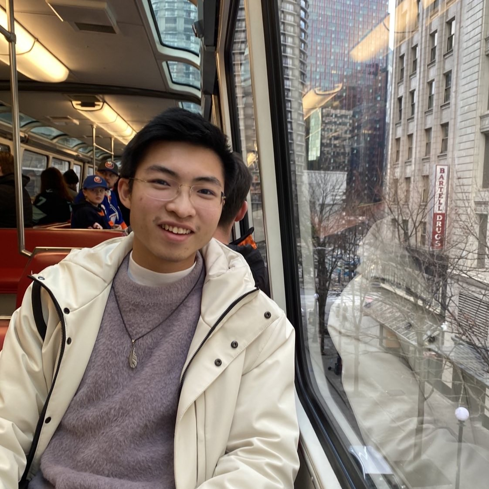

{:.center_element}

I am Caesar Wong and currently  pursuing a Master's degree in Data Science at [UBC](https://www.ubc.ca/),
and I'm excited to bring my expertise to the table.
As a former software engineer and technical consultant, I'm passionate about exploring the cutting-edge of AI and data science, with a focus on creating innovative solutions that help businesses stay ahead of the curve.

On this website, you can discover some of my featured projects and blog posts on software engineering and data sciences. You can also check out my resume to get a better understanding of my experience and skills.

I hope you find my work inspiring and informative, and I look forward to connecting with you!

## Have a Look & Discover

* [Projects]{:.heading.flip-title} --- Projects about data science & software engineering.
* [My Résumé]{:.heading.flip-title} --- Experience and skills.
* [Blog]{:.heading.flip-title} --- A glimpse into my engineering thoughts.
* [About]{:.heading.flip-title} --- Learn more about me.
{:.related-posts.faded}

[projects]: projects/
[My Résumé]: resume/
[blog]: blog/
[About]: about/

## Latest Projects

<!--projects-->

## Latest Posts

<!--posts-->